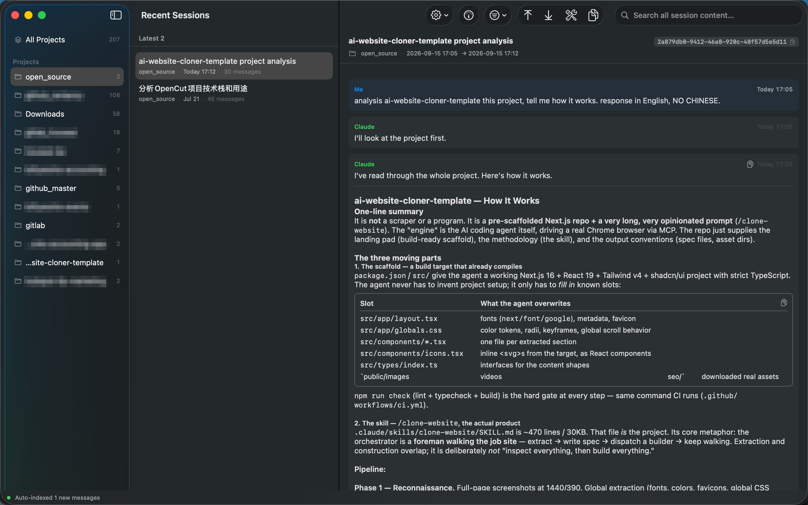

# Claude Session Search

Search every Claude Code session on your Mac by content — across all projects, not just the
one you happen to be in.

`claude --resume` only lists sessions in the current directory, by title. If you remember
*what was said* but not *where*, there is no way to find it. This indexes all of it and
answers a query in 50–200 ms over a 93 MB corpus.

A native macOS app. SwiftUI + SQLite FTS5, **no runtime dependencies**, builds with Command
Line Tools alone (no Xcode required).

> **Unofficial.** Not affiliated with, endorsed by, or supported by Anthropic. It reads the
> session files Claude Code writes on your machine; it does not talk to any Anthropic service.



## Install

Requires **macOS 14 (Sonoma) or later**, Intel or Apple Silicon, and **Xcode Command Line
Tools 15 or newer** (Swift 5.9+). Full Xcode is not needed — CI builds this on a stock
macOS 14 runner with Swift 5.10.

```bash
xcode-select --install     # if you don't have the Command Line Tools yet

git clone https://github.com/liuyfly/claude-session-search.git
cd claude-session-search
./build.sh --install --run
```

That builds a universal binary (arm64 + x86_64), assembles the `.app`, installs it to
`/Applications`, and launches it. First launch indexes everything: on the author's machine
1.1 GB of raw transcripts (205 sessions, 118 subagents) became a 93 MB searchable corpus in
**53 seconds**. Afterwards it is incremental and effectively instant.

Other build modes:

```bash
./build.sh            # build only, output in dist/
./build.sh --fast     # current architecture only (much faster, for development)
./build.sh --run      # build and launch without installing
```

### About the signature

The app is **ad-hoc signed** (`codesign --sign -`). There is no Apple Developer certificate
behind it, so macOS will treat a downloaded build as coming from an unidentified developer.
Building it yourself, as above, avoids this entirely — the quarantine flag is never set on a
binary you compiled locally.

## Privacy

This app reads **all** of your Claude Code transcripts, so here is exactly what it touches.

- **No network requests.** The app itself never opens a socket.
- **Indexing is strictly read-only.** It reads `~/.claude/projects/**/*.jsonl` and writes
  only to `~/Library/Application Support/ClaudeSessionSearch/`.
- **Nothing leaves your machine.** The index is a local SQLite file.

One feature is an exception, and it is opt-in by clicking: **Usage**. It runs
`claude -p "/usage"` as a subprocess, because subscription quota is not stored locally — only
the server knows it. Doing so makes Claude Code create an (empty) project directory, and the
app moves stale files from an older implementation to the Trash at startup. The full list is
in [DESIGN.md](DESIGN.md) (section 「它碰你哪些东西」). If you never click Usage, none of that happens.

To remove everything: delete `~/Library/Application Support/ClaudeSessionSearch/`.

## Usage

Type in the search field. Results group by session, showing the project, date, hit count, and
highlighted excerpts. Click one to read the full transcript.

| Shortcut | Action |
|---|---|
| `⌘F` | Find within the current session |
| `⌥⌘F` | Focus the global search field |
| `⌘G` / `⇧⌘G` | Next / previous hit |
| `⌘↑` / `⌘↓` | Jump to top / bottom of a session |
| `⇧⌘R` | Rebuild the index from scratch |

**Search behaves like this:**

- **Conversation text only, by default.** `thinking` blocks, tool calls, and tool output are
  excluded. Searching `git` matches 37,677 blocks overall but only 2,165 in actual
  conversation — the rest is file contents and command output pulled into context, which
  drowns out what you were looking for. Toggle it on in the filter menu when you want it.
- **Chinese and other non-space-delimited scripts work.** The index uses FTS5's `trigram`
  tokenizer.
- **Short queries fall back automatically.** `trigram` silently returns zero hits for queries
  under 3 characters — the most dangerous failure mode there is, because it looks like "no
  results" rather than "unsupported". Those queries switch to a substring scan (~210–280 ms
  over 93 MB) and the status bar says so.
- **Multiple words are ANDed** against the same message.

**Other features:** live incremental indexing via FSEvents · Markdown rendering of Claude's
replies (with copy buttons on code blocks and tables) · export a session or a whole project
to Markdown + CSV · subscription quota display · recovery of sessions Claude Code has already
deleted · English/Chinese UI · light/dark/system themes.

### Sessions get deleted silently

Claude Code removes transcripts after **30 days** without telling you. To keep them longer,
set this in `~/.claude/settings.json`:

```json
{ "cleanupPeriodDays": 365 }
```

Already lost some? `~/.claude/history.jsonl` is not subject to that window, and
`--recover` mines your prompts back out of it (prompts only — the replies are gone). See
[DESIGN.md](DESIGN.md) (section 「会话会被静默删除」).

## CLI

The same binary runs headless:

```bash
BIN="/Applications/Claude Session Search.app/Contents/MacOS/ClaudeSessionSearch"

"$BIN" --search "some phrase"   # search from the terminal, hits highlighted
"$BIN" --reindex                # incremental index, then exit
"$BIN" --rebuild                # discard and re-parse everything
"$BIN" --export <session> ~/out [--with-tools]
"$BIN" --export-project <name> ~/out
"$BIN" --recover ~/out          # mine deleted sessions out of history.jsonl
"$BIN" --usage                  # subscription quota
"$BIN" --selftest               # build a full index and assert against it
"$BIN" --bench <session>        # per-stage timings when opening a session
```

## How it works

```
~/.claude/projects/<flattened-path>/
├── <session-uuid>.jsonl                 main session
└── <session-uuid>/subagents/
    ├── agent-<id>.jsonl                 subagent session
    └── agent-<id>.meta.json             agentType / description
```

Transcripts are parsed into SQLite with an FTS5 `trigram` index. Indexing is incremental by
**byte offset**, not mtime — `.jsonl` files are append-only, so a 40 MB transcript is never
re-read from the start.

`DESIGN.md` documents every non-obvious decision and the measurements behind it: why the
system Markdown parser is unusable here, why in-session find matches raw UTF-8 bytes instead
of `String.contains`, how a login shell in the usage probe triggered a macOS privacy prompt
attributed to this app, and more. It is written in Chinese.

### Self-test

```bash
"$BIN" --selftest          # auto: runs everything if you have transcripts
"$BIN" --selftest --pure   # corpus-independent assertions only
```

There are two tiers. The **pure tier** (175 assertions) touches no disk at all — Markdown
block splitting, in-session find, reset-time parsing, date formatting, path safety — and
should be green on any machine, in under a second. The **corpus tier** (152 more) builds a
full index from your own `~/.claude/projects` and asserts against it.

Corpus assertions are deliberately **structural**, never scale-based: subset relations,
one-to-one correspondence, "if the sample contains table syntax then at least one table must
be parsed". Nothing is pinned to how many sessions the author happens to have. If you have no
transcripts at all, `--selftest` detects that and runs the pure tier alone.

## License

[MIT](LICENSE)
